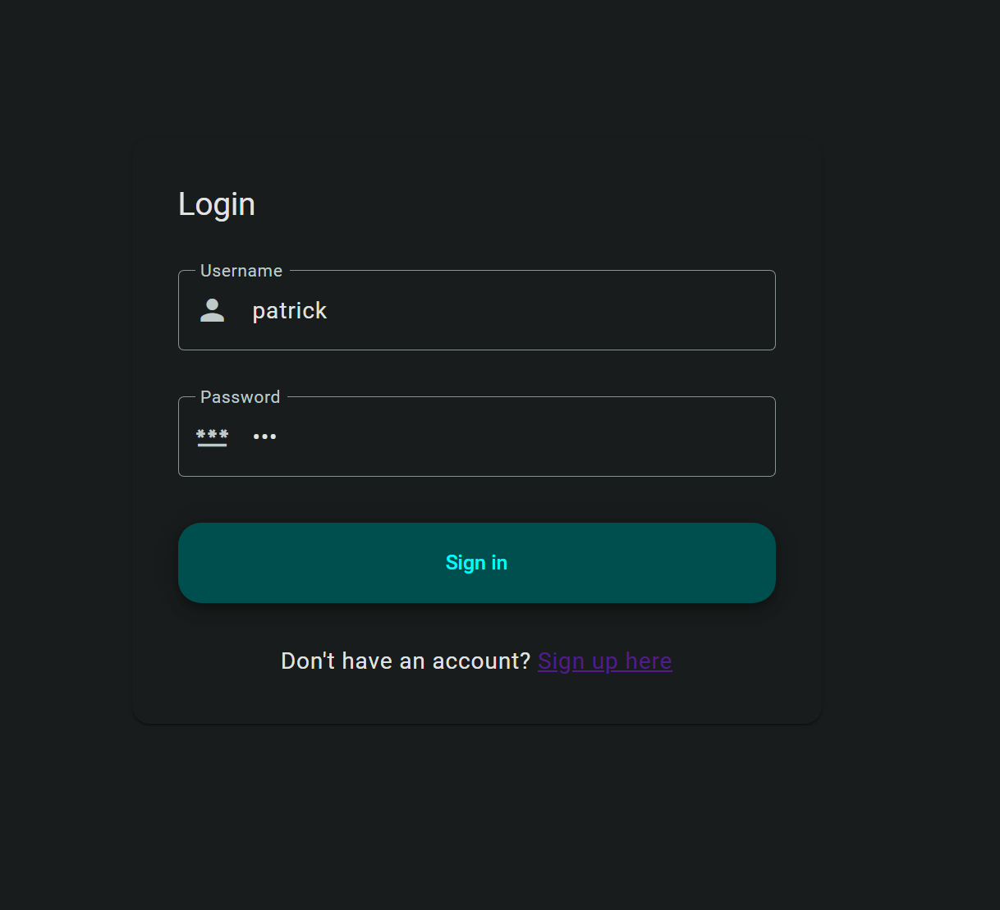
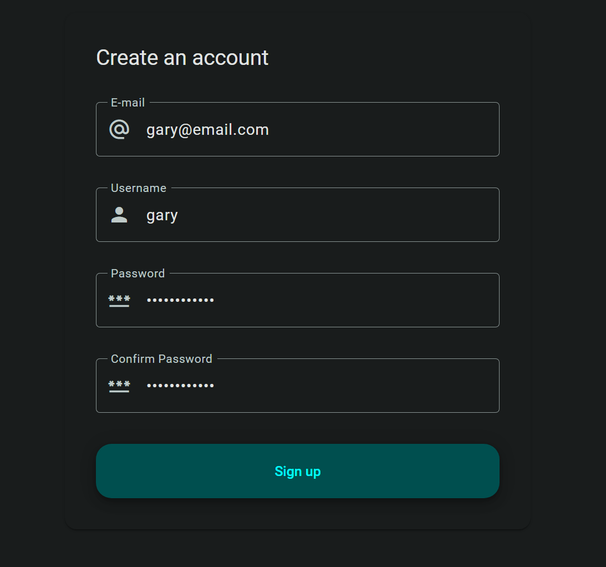
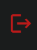
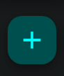
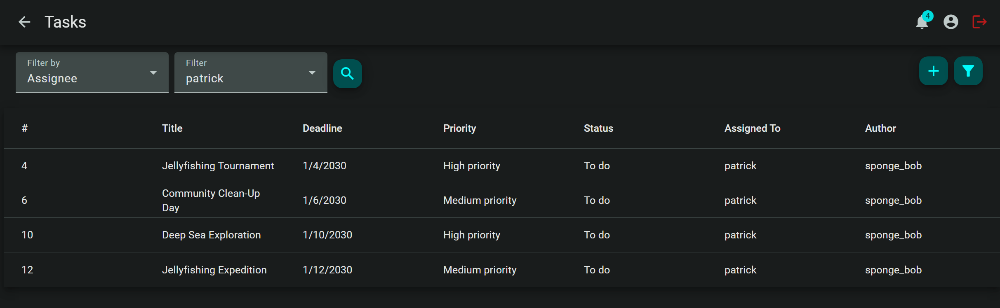
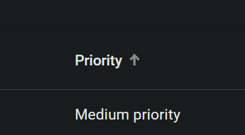
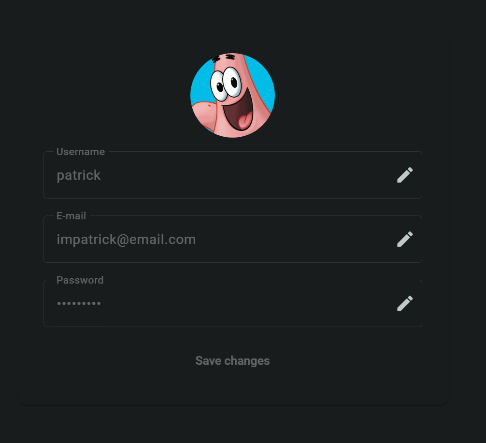
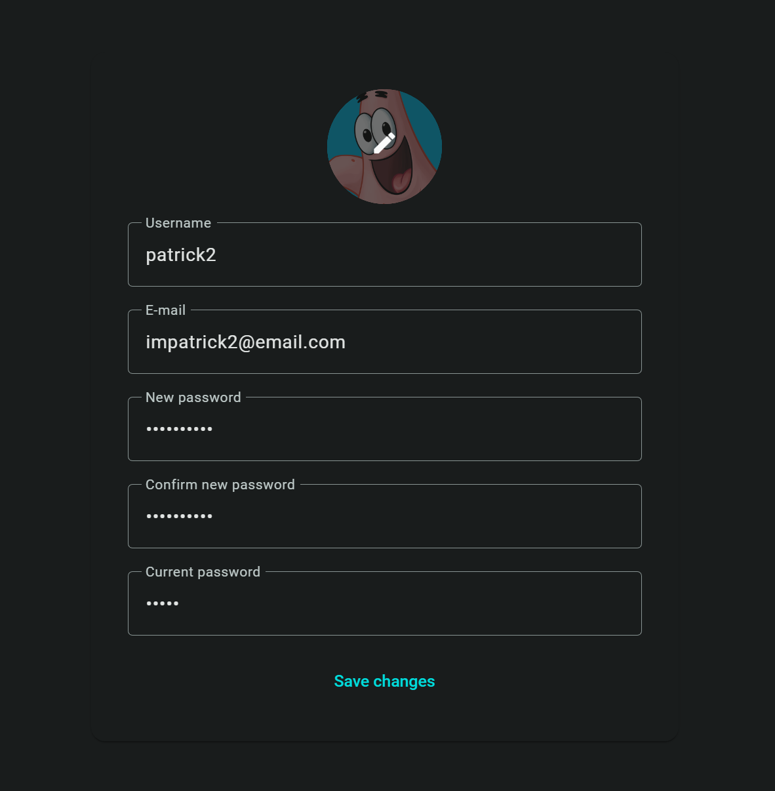
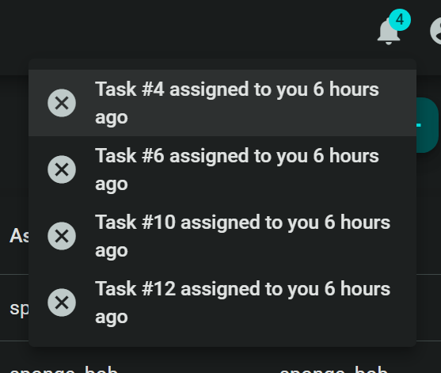

<h1 align=center> Task Management System</h1>

 

    <em>
    The Task Management System is a web-based application designed to help users manage their tasks efficiently. It provides features for creating tasks, assigning them to users, setting deadlines, and tracking progress. The system aims to improve productivity and collaboration within teams by providing a centralized platform for task management.
    </em>

 

## Technologies Used

- Frontend: Angular
- Backend: .NET Core
- Database: SQL Server

## Running demo

[Click here to see the project running](https://task-management-system.madriano188599.xyz)

You can use one of the seeded users listed below or sign up and create your own user

| Username   | Password |
| ---------- | -------- |
| sponge_bob | pass123  |
| patrick    | 123      |
| squidward  | 123      |
| mr_krabs   | money    |

## Features

### 1. User Authentication

- Log in

    

     

- Sign in (by clicking in the "Sign up here" link as illustrated in the image above)

    

     

- Log out (by clicking the button found in the top right corner after logging in)

    

     

### 2. Task Management

- Users can create new tasks, specifying a title, description, deadline, and assignee. (Create a task by clicking on the top right button as shown below)

    

     

- Tasks can be categorized by status (To Do, In Progress, Done)

- Users can edit and delete tasks they created

- Tasks can be assigned to specific users within the system

 

### 3. Task Filtering and Sorting

- Users can filter tasks based on criteria such as status, assignee, and deadline

    

     

- Tasks can be sorted by various attributes (id, deadline, priority)

    

     

### 4. Task Details View:

- Clicking on a task will display detailed information including title, description, deadline, assignee, and status

- Users can update the status of tasks (e.g., mark as in progress, mark as completed)

 

### 5. User Profile

- Users can view and edit their profile information (name, email, password)

    

     

- Profile pictures can be uploaded and displayed (clicking on the profile picture will alow you to add/remove/change your picture)

    

     

### 6. Notification System

- Users receive notifications for tasks assigned to them

- Notifications are displayed within the application (you can dissmis by clicking on it)

    

     
